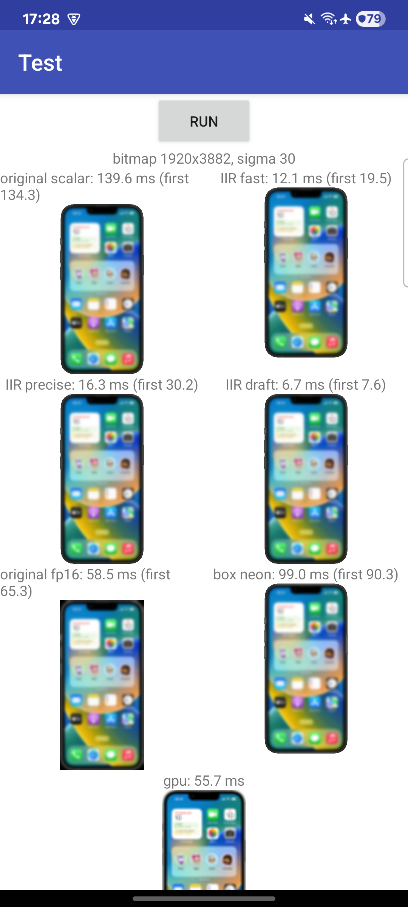

# IIR Blur (Android, NDK)

CPU Gaussian blur approximation with O(width × height) work, independent of the
blur radius. `Utils.blurNeon` uses an optimized ARM64 NEON implementation and a
portable fallback on other Android ABIs. The scalar, FP16, box and GPU versions
remain in the demo for comparison.

```java
Bitmap bitmap = source.copy(Bitmap.Config.ARGB_8888, true);
Utils.blurNeon(bitmap, 30f);
```

The bitmap must be mutable, software-backed ARGB_8888. RGB is blurred in place;
alpha is preserved. The implementation respects row stride and handles arbitrary
image sizes. Sigma must be finite and non-negative; zero is a no-op.

The optimized path keeps FP32 precision, uses four-row SIMD filtering and a
64-byte-aligned buffer of narrow RGB strips for contiguous vertical passes.
Workspaces and workers are reused, and the caller participates in processing.
A numerically stable difference recurrence avoids the large-radius cancellation
of the original implementation. No image downsampling is performed.

See [benchmarks, correctness checks and implementation details](benchmarks/README.md)
for reproducible comparisons against the original source on a Samsung Galaxy S21.

## Try the demo

[Download the updated demo APK](demo.apk).

The screenshot shows the demo running on a Samsung Galaxy S21 (Exynos 2100),
processing a 1920×3882 bitmap. These are timings from a single demo run;
repeatable A/B measurements are available in the benchmark report above.



## Build and test

Android SDK 34, NDK 21.4.7075529, JDK 17+:

```sh
./gradlew :app:assembleDebug
./gradlew :app:connectedDebugAndroidTest
python3 benchmarks/run.py -- --test
```

The demo APK is built at `app/build/outputs/apk/debug/app-debug.apk`.
