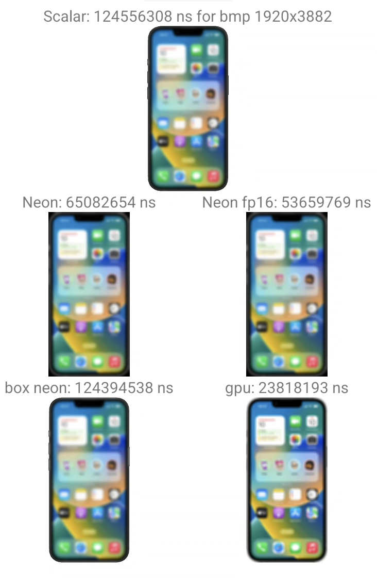

# IIR Blur (Android, NDK)

Fast Gaussian blur implementation that runs **entirely on the CPU** using an Infinite‑Impulse‑Response (IIR) filter. The code is written in C++ and comes in two flavours:

* **Scalar** ‑ portable, works on every Android CPU
* **NEON** ‑ hand‑optimized SIMD kernels that are up to 3× faster on ARMv8 devices

for comparison fp16 version, box blur and gpu blur also added

For real use bitmaps may be pre-downscaled

## Try it out

Grab the sample application:

[Download `demo.apk`](demo.apk)

## How it works

The algorithm is based on the Deriche formulation of the Gaussian blur. Instead of convolving with a large kernel (O(r²)), it uses recursive filters that achieve the same visual result in **O(N)** time, independent of the radius. The two‑pass (horizontal + vertical) implementation keeps the memory footprint low. When NEON is available we process four pixels per register and interleave loads/stores to maximise throughput.
